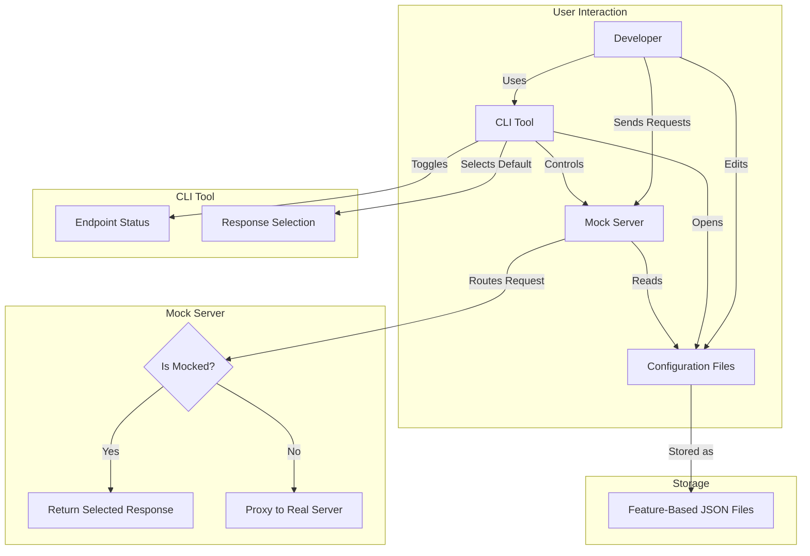
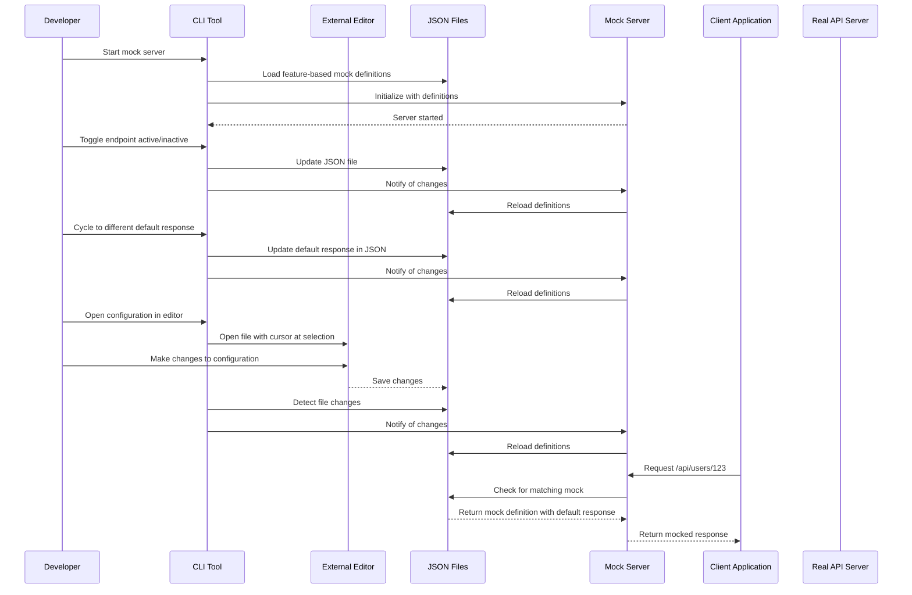

# Mockoho: Mock Server System Architecture

This document outlines the architecture for a mock server system designed to facilitate frontend development without a ready backend and to easily update responses for demo purposes.

## 1. Recommended Technologies/Frameworks

### For the Mock Server:

- **Core Framework**: [Gin](https://github.com/gin-gonic/gin) - A fast, lightweight web framework for Go
- **Proxy Functionality**: [httputil.ReverseProxy](https://pkg.go.dev/net/http/httputil#ReverseProxy) from Go's standard library
- **Configuration Management**: [Viper](https://github.com/spf13/viper) for flexible configuration handling
- **Data Storage**: JSON files organized by feature name

### For the CLI Tool:

- **Terminal UI**: [Bubble Tea](https://github.com/charmbracelet/bubbletea) - A powerful TUI framework for Go
- **Keyboard Shortcuts**: [Bubbles](https://github.com/charmbracelet/bubbles) - Components for Bubble Tea
- **Command Processing**: [Cobra](https://github.com/spf13/cobra) - A library for creating powerful CLI applications
- **Editor Integration**: [os/exec](https://pkg.go.dev/os/exec) to open files in the user's preferred editor

## 2. Overall System Architecture



## 3. Data Structure for Storing Mock Configurations

### Directory Structure:

```
mocks/
  ├── users.json     # User-related endpoints
  ├── products.json  # Product-related endpoints
  ├── orders.json    # Order-related endpoints
  └── config.json    # Global configuration
```

### Global Configuration (config.json):

```json
{
  "proxyConfig": {
    "target": "https://api.real-server.com",
    "changeOrigin": true,
    "pathRewrite": {
      "^/api": ""
    }
  },
  "serverConfig": {
    "port": 3000,
    "host": "localhost"
  }
}
```

### Feature-Based Mock Definition with Multiple Responses (e.g., users.json):

```json
{
  "feature": "users",
  "endpoints": [
    {
      "id": "get-user-profile",
      "method": "GET",
      "path": "/api/users/:id",
      "active": true,
      "defaultResponse": "standard",
      "responses": {
        "standard": {
          "status": 200,
          "headers": {
            "Content-Type": "application/json"
          },
          "body": {
            "id": "{{params.id}}",
            "name": "John Doe",
            "email": "john@example.com"
          },
          "delay": 200
        },
        "premium": {
          "status": 200,
          "headers": {
            "Content-Type": "application/json"
          },
          "body": {
            "id": "{{params.id}}",
            "name": "John Doe",
            "email": "john@example.com",
            "premium": true,
            "memberSince": "2020-01-01"
          },
          "delay": 200
        },
        "error": {
          "status": 404,
          "headers": {
            "Content-Type": "application/json"
          },
          "body": {
            "error": "User not found",
            "code": "USER_NOT_FOUND"
          },
          "delay": 100
        }
      }
    },
    {
      "id": "create-user",
      "method": "POST",
      "path": "/api/users",
      "active": true,
      "defaultResponse": "success",
      "responses": {
        "success": {
          "status": 201,
          "headers": {
            "Content-Type": "application/json"
          },
          "body": {
            "id": "new-user-123",
            "name": "New User",
            "email": "new@example.com",
            "createdAt": "{{now}}"
          }
        },
        "validation-error": {
          "status": 400,
          "headers": {
            "Content-Type": "application/json"
          },
          "body": {
            "error": "Validation failed",
            "fields": {
              "email": "Invalid email format"
            }
          }
        }
      }
    }
  ]
}
```

## 4. Ultra-Compact CLI Tool Interface and Intuitive Keyboard Shortcuts

### Ultra-Compact CLI Interface Design:

```
┌─ Mockoho ─────────────────────────────────────────────────────────────────┐
│ Server: Running (localhost:3000) | Proxy: api.real-server.com             │
├─────────────────────────────────────────────────────────────────────────────┤
│ Features    | Endpoints (users)                                           │
├─────────────┼───────────────────────────────────────────────────────────────┤
│ > users     | > GET /api/users/:id           [✓] [standard*|premium|error] │
│   products  |   POST /api/users              [✓] [success*|validation-error]│
│   orders    |   PUT /api/users/:id           [✗] [success*|error]          │
│             |   DELETE /api/users/:id        [✗] [success*]                │
├─────────────┴───────────────────────────────────────────────────────────────┤
│ [t]oggle [r]esponse [o]pen [n]ew [d]elete [p]roxy [s]erver [q]uit [h]elp │
└─────────────────────────────────────────────────────────────────────────────┘
```

### Intuitive Keyboard Shortcuts:

| Key    | Action        | Description                                        |
| ------ | ------------- | -------------------------------------------------- |
| Tab    | Switch Panel  | Switch between Features and Endpoints panels       |
| ↑/↓    | Navigate List | Move up/down in the current panel                  |
| Enter  | Select Item   | Select a feature or endpoint                       |
| t      | Toggle        | Toggle endpoint active/inactive                    |
| r      | Response      | Cycle through available responses for the endpoint |
| o      | Open          | Open configuration file in default editor          |
| n      | New           | Create new endpoint or feature                     |
| d      | Delete        | Delete selected endpoint or feature                |
| p      | Proxy         | Change proxy target                                |
| s      | Server        | Start/stop server                                  |
| q      | Quit          | Exit the application                               |
| h      | Help          | Show help screen with all shortcuts                |
| /      | Search        | Search for endpoints                               |
| Ctrl+r | Reload        | Reload configurations from disk                    |

### Help Screen:

```
┌─ Mockoho Help ─────────────────────────────────────────────────────────────┐
│                                                                            │
│  Navigation:                                                               │
│    Tab       - Switch between Features and Endpoints panels                │
│    ↑/↓       - Navigate up/down in the current panel                       │
│    Enter     - Select a feature or endpoint                                │
│                                                                            │
│  Actions:                                                                  │
│    t         - Toggle endpoint active/inactive                             │
│    r         - Cycle through available responses (sets as default)         │
│    o         - Open configuration file in default editor                   │
│    n         - Create new endpoint or feature                              │
│    d         - Delete selected endpoint or feature                         │
│    p         - Change proxy target                                         │
│    s         - Start/stop server                                           │
│    q         - Quit application                                            │
│    h         - Show this help screen                                       │
│    /         - Search for endpoints                                        │
│    Ctrl+r    - Reload configurations from disk                             │
│                                                                            │
│  Press any key to return...                                                │
└────────────────────────────────────────────────────────────────────────────┘
```

### New Endpoint/Feature Dialog:

```
┌─ New Item ───────────────────────────────────────────────────────────────┐
│                                                                          │
│  Create new:  (F)eature  (E)ndpoint                                      │
│                                                                          │
│  Name: [_________________________________________________]               │
│                                                                          │
│  For endpoint:                                                           │
│    Method: [GET]  Path: [_________________________________]               │
│                                                                          │
│                                                                          │
│  [Enter] Confirm  [Esc] Cancel                                           │
│                                                                          │
└──────────────────────────────────────────────────────────────────────────┘
```

## 5. Key Features and Implementation Approach

### Mock Server Features:

1. **Dynamic Route Handling**:

   - Register routes based on feature-based mock definitions
   - Support path parameters and pattern matching
   - Hot reload when configurations change

2. **Multiple Response Support**:

   - Each endpoint can have multiple named responses
   - Default response selection
   - Easy switching between responses via CLI

3. **Response Generation**:

   - Template-based response generation
   - Support for basic variables like `{{params.id}}` and `{{now}}`
   - Configurable response delay

4. **Proxy Mode**:
   - Transparent proxying to real backend
   - Header forwarding
   - Path rewriting based on configuration

### Ultra-Compact CLI Tool Features:

1. **Minimal Interactive TUI**:

   - Space-efficient single-screen interface
   - Intuitive keyboard navigation
   - Direct endpoint and response management

2. **Direct Actions**:

   - Toggle endpoints on/off with a single keystroke
   - Cycle through and set default responses directly
   - Open configuration files in external editor

3. **External Editor Integration**:

   - Open configuration files in user's preferred editor
   - Position cursor at selected endpoint or response
   - Reload configurations after editing

4. **Server Control**:
   - Start/stop server
   - Change proxy target
   - View active connections

### Implementation Approach:



## 6. External Editor Integration

The CLI tool will integrate with VSCode, Vim, and GoLand through the following approach:

1. **Editor Detection**:

   - Check `EDITOR` or `VISUAL` environment variables
   - Allow explicit configuration in a settings file
   - Default to searching for VSCode, Vim, and GoLand in standard locations

2. **Editor-Specific Integration**:

   **VSCode Integration**:

   ```go
   // Open file at specific line in VSCode
   cmd := exec.Command("code", "-g", "mocks/users.json:42")
   cmd.Run()
   ```

   **Vim Integration**:

   ```go
   // Open file at specific line in Vim
   cmd := exec.Command("vim", "+42", "mocks/users.json")
   cmd.Run()
   ```

   **GoLand Integration**:

   ```go
   // Open file at specific line in GoLand
   // Using the command-line launcher 'goland'
   cmd := exec.Command("goland", "--line", "42", "mocks/users.json")
   cmd.Run()
   ```

3. **File Watching**:

   - Monitor configuration files for changes
   - Reload when changes are detected
   - Update the TUI to reflect changes

4. **Editor Configuration**:
   - Allow users to specify their preferred editor in the config file:
   ```json
   {
     "editor": {
       "command": "code",
       "args": ["-g", "{file}:{line}"]
     }
   }
   ```
   - Provide preset configurations for VSCode, Vim, and GoLand

## 7. Implementation Roadmap

1. **Phase 1: Core Server**

   - Basic HTTP server with route matching
   - Simple JSON-based mock definitions
   - Proxy functionality for non-matched routes

2. **Phase 2: Multiple Response Handling**

   - Support for multiple responses per endpoint
   - Default response selection
   - Template-based response generation

3. **Phase 3: Ultra-Compact CLI Tool**

   - Space-efficient terminal UI
   - Direct endpoint toggling and response selection
   - External editor integration

4. **Phase 4: Advanced Features**
   - Import/export functionality
   - Request logging
   - Response templating enhancements
