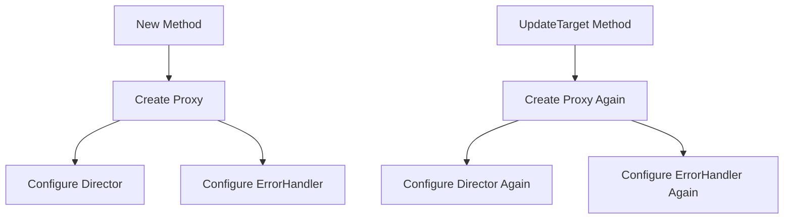
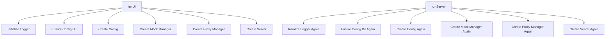

# Mockoho Codebase Refactoring Plan

After thoroughly analyzing the Mockoho codebase, I've identified several areas where we can improve code quality by removing unused code, refactoring duplicated functionality, and simplifying complex functions. This plan outlines the specific changes needed to make the codebase more maintainable, efficient, and clean.

## 1. Duplicated Code Removal

### 1.1. Proxy Manager Refactoring

The `proxy.go` file contains significant duplication between the `New` and `UpdateTarget` methods:



**Recommendation:** Extract the common proxy creation logic into a private helper method:

```go
// createReverseProxy creates a configured reverse proxy for the given target URL
func (m *Manager) createReverseProxy(targetURL *url.URL) *httputil.ReverseProxy {
    proxy := httputil.NewSingleHostReverseProxy(targetURL)

    // Configure director
    originalDirector := proxy.Director
    proxy.Director = func(req *http.Request) {
        originalDirector(req)

        // Apply path rewriting
        for pattern, replacement := range m.Config.Global.ProxyConfig.PathRewrite {
            re, err := regexp.Compile(pattern)
            if err != nil {
                continue
            }
            req.URL.Path = re.ReplaceAllString(req.URL.Path, replacement)
        }

        // Set the Host header to the target host if changeOrigin is true
        if m.Config.Global.ProxyConfig.ChangeOrigin {
            req.Host = targetURL.Host
        }
    }

    // Add custom error handler
    proxy.ErrorHandler = func(w http.ResponseWriter, r *http.Request, err error) {
        logger.ProxyError(targetURL.String(), err)
        w.WriteHeader(http.StatusBadGateway)
        w.Write([]byte("Proxy Error"))
    }

    return proxy
}
```

Then simplify both `New` and `UpdateTarget` to use this helper method.

### 1.2. Server Setup Duplication

In `main.go`, there's significant duplication between `runUI` and `runServer` functions:



**Recommendation:** Extract the common setup code into a helper function:

```go
// setupServer initializes and returns the common components needed for both UI and server modes
func setupServer() (*config.Config, *mock.Manager, *proxy.Manager, *server.Server, error) {
    // Initialize logger
    if err := logger.Init(debugMode); err != nil {
        return nil, nil, nil, nil, fmt.Errorf("error initializing logger: %v", err)
    }

    // Ensure config directory exists
    if err := ensureConfigDir(); err != nil {
        logger.Error("Failed to ensure config directory: %v", err)
        return nil, nil, nil, nil, fmt.Errorf("error: %v", err)
    }

    // Create config
    cfg := config.New(ConfigDir)
    if err := cfg.Load(); err != nil {
        logger.Error("Failed to load configuration: %v", err)
        return nil, nil, nil, nil, fmt.Errorf("error loading configuration: %v", err)
    }

    // Create mock manager
    mockManager := mock.New(cfg)

    // Create proxy manager
    proxyManager, err := proxy.New(cfg)
    if err != nil {
        logger.Error("Failed to create proxy manager: %v", err)
        return nil, nil, nil, nil, fmt.Errorf("error creating proxy manager: %v", err)
    }

    // Create server
    srv := server.New(cfg, mockManager, proxyManager)

    return cfg, mockManager, proxyManager, srv, nil
}
```

Then simplify both `runUI` and `runServer` to use this helper function.

### 1.3. Path Matching Logic in Mock Manager

In `mock.go`, the `pathMatches` function contains redundant logic:

**Recommendation:** Simplify the path matching logic by removing the unused regex parts and focusing on the direct path comparison:

```go
// pathMatches checks if a request path matches an endpoint path pattern
func (m *Manager) pathMatches(pattern, path string) bool {
    patternParts := strings.Split(pattern, "/")
    pathParts := strings.Split(path, "/")

    if len(patternParts) != len(pathParts) {
        return false
    }

    for i := range patternParts {
        if strings.HasPrefix(patternParts[i], ":") {
            // This is a parameter, so it matches anything
            continue
        }
        if patternParts[i] != pathParts[i] {
            return false
        }
    }

    return true
}
```

## 2. Unused and Inefficient Code

### 2.1. Logger Optimization

The `prependWriter` implementation in `logger.go` is inefficient as it reads and rewrites the entire log file for each log entry:

**Recommendation:** Replace with a simpler append-only logger and use a rotation strategy if needed:

```go
// Init initializes the logger
func Init(debug bool) error {
    IsDebugMode = debug

    // Open the log file for appending
    var err error
    File, err = os.OpenFile("debug.log", os.O_APPEND|os.O_CREATE|os.O_WRONLY, 0644)
    if err != nil {
        return fmt.Errorf("failed to open log file: %w", err)
    }

    // Initialize the logger
    Logger = log.New(File, "", 0)

    // Add a line break to separate sessions
    if _, err := File.WriteString("\n\n"); err != nil {
        return fmt.Errorf("failed to write session separator: %w", err)
    }

    // Log initialization
    Info("Logger initialized, debug mode: %v", debug)

    return nil
}
```

### 2.2. UI Model Optimization

In `ui/model.go`, there are several functions that could be optimized:

**Recommendation:** Simplify the list initialization and update functions by removing redundant code:

1. Combine the common parts of `initFeaturesList` and `initEndpointsList` into a helper function
2. Remove the redundant sorting logic in `updateEndpointsList` by using Go's built-in `sort` package
3. Simplify the delegate style creation in `updateListDelegatesForActivePanel`

### 2.3. Config Error Handling

In `config.go`, there's redundant error handling and logging:

**Recommendation:** Simplify error handling by removing redundant logging:

```go
// SaveGlobalConfig saves the global configuration to its file
func (c *Config) SaveGlobalConfig() error {
    c.mu.Lock()
    defer c.mu.Unlock()

    path := filepath.Join(c.BaseDir, "config.json")

    // Check if directory exists
    dirInfo, err := os.Stat(c.BaseDir)
    if err != nil {
        return fmt.Errorf("failed to stat directory: %w", err)
    }

    if !dirInfo.IsDir() {
        return fmt.Errorf("%s is not a directory", c.BaseDir)
    }

    data, err := json.MarshalIndent(c.Global, "", "  ")
    if err != nil {
        return fmt.Errorf("failed to marshal global config: %w", err)
    }

    // Write directly to the file
    if err := os.WriteFile(path, data, 0644); err != nil {
        return fmt.Errorf("failed to write config file: %w", err)
    }

    logger.Info("Global config saved successfully to %s", path)
    return nil
}
```

## 3. Complex Function Refactoring

### 3.1. Server Request Handler

The `handleRequest` function in `server.go` could be broken down into smaller, more focused functions:

**Recommendation:** Split the function into smaller helper methods:

```go
// handleRequest handles an incoming request
func (s *Server) handleRequest(c *gin.Context) {
    method := c.Request.Method
    path := c.Request.URL.Path

    // Try to find a matching endpoint
    endpoint, _, err := s.MockManager.FindEndpoint(method, path)
    if err != nil || !endpoint.Active {
        // No matching endpoint or endpoint is inactive, proxy the request
        s.ProxyManager.Handle(c)
        return
    }

    // Handle the mock response
    s.handleMockResponse(c, endpoint, path)
}

// handleMockResponse generates and sends a mock response
func (s *Server) handleMockResponse(c *gin.Context, endpoint *config.Endpoint, path string) {
    // Extract path parameters
    params := s.MockManager.ExtractParams(endpoint.Path, path)

    // Generate response
    response, err := s.MockManager.GenerateResponse(endpoint, params)
    if err != nil {
        c.JSON(http.StatusInternalServerError, gin.H{
            "error": fmt.Sprintf("Failed to generate response: %v", err),
        })
        return
    }

    // Apply delay if specified
    if response.Delay > 0 {
        time.Sleep(time.Duration(response.Delay) * time.Millisecond)
    }

    // Send the response
    s.sendResponse(c, response)
}

// sendResponse sends the response to the client
func (s *Server) sendResponse(c *gin.Context, response *config.Response) {
    // Set response headers
    for key, value := range response.Headers {
        c.Header(key, value)
    }

    // Set response status
    c.Status(response.Status)

    // Handle string JSON bodies
    if bodyStr, ok := response.Body.(string); ok {
        var jsonBody interface{}
        if err := json.Unmarshal([]byte(bodyStr), &jsonBody); err == nil {
            c.Writer.Header().Set("Content-Type", "application/json")
            c.Writer.WriteString(bodyStr)

            // Log the request
            logger.HTTPRequest(c.Request.Method, c.Request.URL.Path, c.ClientIP(), c.Writer.Status(), time.Since(time.Now()))
            return
        }
    }

    // Otherwise, render as JSON
    c.JSON(response.Status, response.Body)

    // Log the request
    logger.HTTPRequest(c.Request.Method, c.Request.URL.Path, c.ClientIP(), c.Writer.Status(), time.Since(time.Now()))
}
```

### 3.2. Response Body Processing

The `processResponseBody` function in `mock.go` could be simplified:

**Recommendation:** Refactor to make the template processing more straightforward:

```go
// processResponseBody processes template variables in the response body
func (m *Manager) processResponseBody(response *config.Response, params map[string]string) error {
    // Skip processing if body is nil
    if response.Body == nil {
        return nil
    }

    // Convert body to JSON string
    bodyJSON, err := json.Marshal(response.Body)
    if err != nil {
        return fmt.Errorf("failed to marshal response body: %w", err)
    }

    // Create template data
    data := map[string]interface{}{
        "params": params,
        "now":    time.Now().Format(time.RFC3339),
    }

    // Process template
    tmpl, err := template.New("body").Parse(string(bodyJSON))
    if err != nil {
        return fmt.Errorf("failed to parse response template: %w", err)
    }

    var buf bytes.Buffer
    if err := tmpl.Execute(&buf, data); err != nil {
        return fmt.Errorf("failed to execute response template: %w", err)
    }

    // Parse the processed JSON back into the response body
    var processedBody interface{}
    if err := json.Unmarshal(buf.Bytes(), &processedBody); err != nil {
        return fmt.Errorf("failed to unmarshal processed response: %w", err)
    }

    response.Body = processedBody
    return nil
}
```

## 4. Implementation Plan

Here's the recommended order for implementing these changes:

1. Start with the helper functions extraction (setupServer, createReverseProxy)
2. Refactor the complex functions (handleRequest, processResponseBody)
3. Simplify the path matching logic
4. Optimize the logger implementation
5. Clean up the UI model code
6. Improve error handling in the config package

For each change:

1. Create a backup of the original file
2. Make the changes
3. Run tests to ensure functionality is preserved
4. Update any affected documentation

## 5. Testing Strategy

For each refactoring:

1. Run the existing test suite to ensure no regressions
2. Add new unit tests for the refactored functions
3. Perform manual testing of the UI and server functionality
4. Verify that all features still work as expected

## 6. Expected Benefits

These refactorings will result in:

1. Reduced code duplication, making maintenance easier
2. Improved performance, especially for logging
3. Better code organization with clearer responsibilities
4. Enhanced readability and maintainability
5. Reduced complexity, making future changes easier
